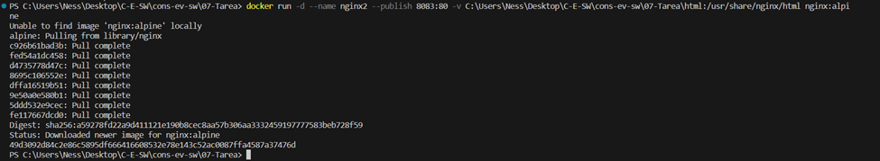
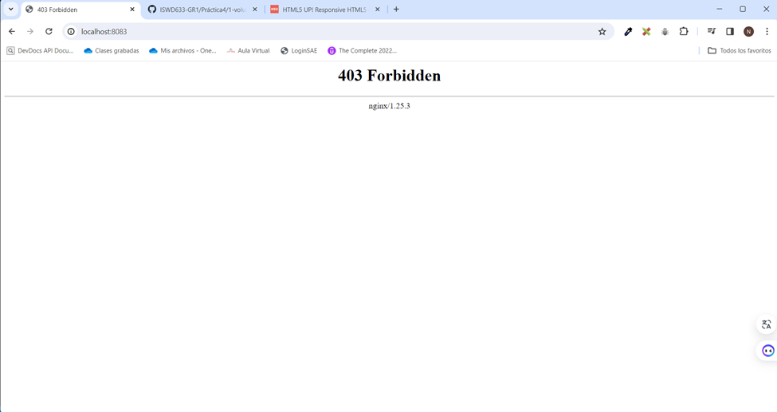
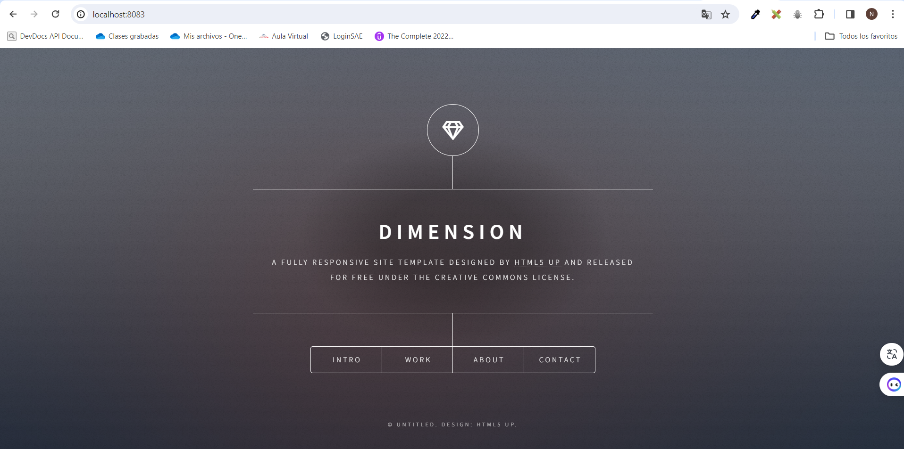
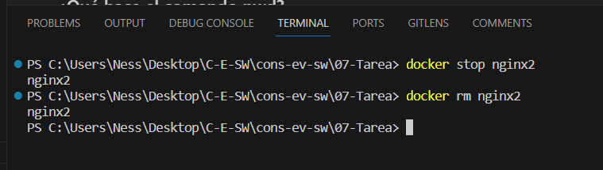
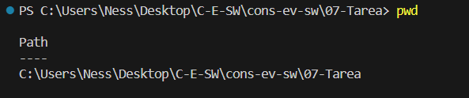
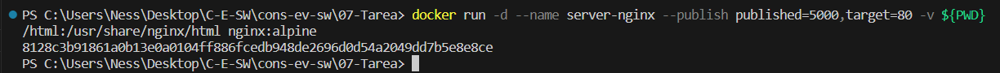
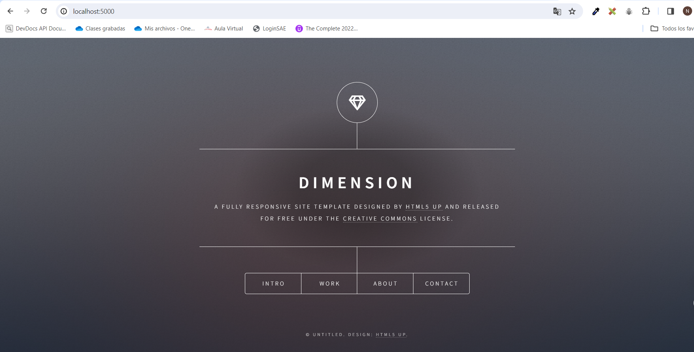

# Volúmenes

## HOST

### Volumen tipo host con la imagen nginx:alpine 
### ruta carpeta host: directorio en donde se encuentra la carpeta html en nuestro computador, usar \\
### ruta carpeta contenedor: /usr/share/nginx/html desde la documentación

```
docker run -d --name <nombre contenedor> --publish <mapeo de puertos> -v <ruta carpeta host>:<ruta carpeta contenedor> url: <nombre imagen>
```

Se utiliza el siguiente comando:  
```
docker run -d --name nginx2 --publish 8083:80 -v C:\Users\Ness\Desktop\C-E-SW\cons-ev-sw\07-Tarea\html:/usr/share/nginx/html nginx:alpine
```

Y el resultado:  


### ¿Qué sucede al ingresar al servidor de nginx?

Al intentar acceder al servidor mediante el localhost en el puerto 8083 se muestra la siguiente pantalla con 403 Forbidden. El error generalmente indica que el servidor ha denegado el acceso al recurso solicitado.



### ¿Qué pasa con el archivo index.html del contenedor?

El archivo `index.html` en el contenedor de Docker es el archivo que Nginx intenta servir cuando se accede a la raíz del sitio (por ejemplo, `localhost:8083`). Este archivo se encuentra en la ruta `/usr/share/nginx/html/` dentro del contenedor de Docker⁴.

Al ejecutar el comando `docker run` con la opción `-v`, se mapea el directorio local `C:\Users\Ness\Desktop\C-E-SW\cons-ev-sw\07-Tarea\html` al directorio `/usr/share/nginx/html` en el contenedor de Docker. Esto significa que cualquier archivo que se coloque en el directorio local `html` estará disponible en el directorio `/usr/share/nginx/html` dentro del contenedor de Docker.

Si no tienes un archivo `index.html` en tu directorio local `html`, entonces no habrá un archivo `index.html` en el directorio `/usr/share/nginx/html` dentro del contenedor de Docker. Como resultado, cuando intentas acceder a `localhost:8083`, Nginx no puede encontrar un archivo `index.html` para servir y devuelve un error `403 Forbidden`.


### Ir a https://html5up.net/ y descargar un template gratuito - descomprimir en la carpeta html

Se escoge el template de preferencia denominado *Dimension* y se descomprime en el `html`  del directorio local.
### ¿Qué sucede al ingresar al servidor de nginx?
Se recarga la página y ahora el resultado es la página web del preview del template descargado.

### Eliminar el contenedor

```
docker rm nginx2
```
Así:  



### ¿Qué sucede al crear nuevamente el mismo contenedor con volumen de tipo host a los directorios definidos anteriormente?
Al ejecutar el mismo comando, el resultado es el mismo, se carga la página web del template.
```
docker run -d --name nginx2 --publish 8083:80 -v C:\Users\Ness\Desktop\C-E-SW\cons-ev-sw\07-Tarea\html:/usr/share/nginx/html nginx:alpine
```

### ¿Qué hace el comando pwd?
El comando `pwd` imprime la ruta completa del directorio de trabajo actual. Así:



### Volumen tipo host usando PWD y PowerShell
```
docker run -d --name server-nginx --publish published=5000,target=80 -v ${PWD}/html:/usr/share/nginx/html nginx:alpine
```
Se ejecuta:  

Se obtiene el mismo resultado:

