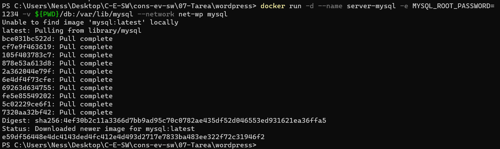
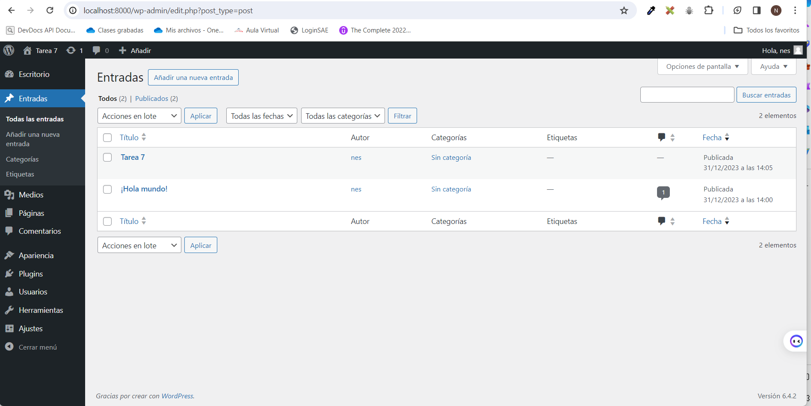

# Wordpress

### Crear red net-wp

```
docker network create net-wp

```
El resultado:  


### Para que persista la información es necesario conocer ¿en dónde mysql almacena la información?

Los datos de MySQL se almacenan en la ruta /var/lib/mysql dentro del contenedor. Para que los datos persistan después de que el contenedor se detenga o se elimine, se puede montar un volumen Docker en esa ruta. 
### ruta carpeta host: db
### Crear contenedor de MySQL en la red net-wp

Se puede usar: 
```
docker run -d --name server-mysql -e MYSQL_ROOT_PASSWORD=1234 -v C:\Users\Ness\Desktop\C-E-SW\cons-ev-sw\07-Tarea\wordpress\db:/var/lib/mysql --network net-wp mysql

```
o en el PS
```
docker run -d --name server-mysql -e MYSQL_ROOT_PASSWORD=1234 -v ${PWD}/db:/var/lib/mysql --network net-wp mysql

```
El resultado a continuación:



### Para que persista la información es necesario conocer ¿en dónde wordpress almacena la información?

WordPress almacena su información en dos lugares principales:

- Base de datos MySQL: En un contenedor Docker, los datos de MySQL se almacenan en la ruta `/var/lib/mysql`.
- Directorio wp-content: Este directorio contiene temas, complementos y archivos multimedia cargados en tu sitio de WordPress1. En un contenedor Docker, este directorio se encuentra en la ruta `/var/www/html/wp-content`.
### ruta carpeta host: www
### Crear contenedor de Wordpress en la red net-wp

```
docker run -d --name server-wordpress -e WORDPRESS_DB_HOST=server-mysql -e WORDPRESS_DB_USER=root -e WORDPRESS_DB_PASSWORD=1234 -e WORDPRESS_DB_NAME=db_drupal -p 8000:80 -v  ${PWD}/www:/var/www/html --network net-wp wordpress
```
### Personalizar la apariencia de wordpress y agregar una entrada
Se crea una entrada:


### Eliminar el contenedor y crearlo nuevamente, ¿qué ha sucedido?

Al crear el contenedor nuevamente, se montan los volúmenes para acceder a los mismos datos

```
```